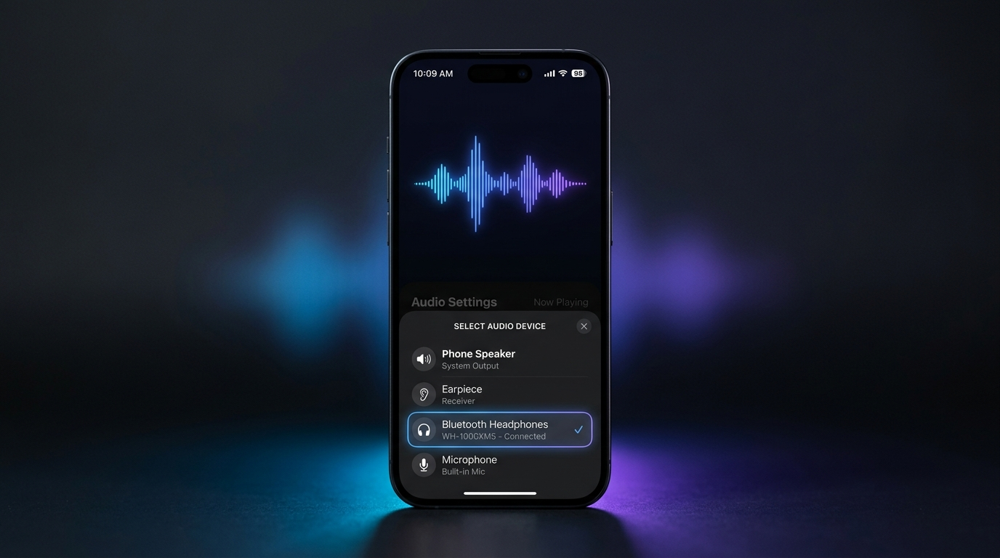

# audio_output_picker

[](https://pub.dev/packages/audio_output_picker)
[](https://pub.dev/packages/audio_output_picker)
[](https://opensource.org/licenses/MIT)
[](https://flutter.dev)

A powerful, cross-platform Flutter plugin to enumerate, monitor, and switch audio output devices (Speakers, Earpiece/Receiver, Headphones, Bluetooth, USB, AirPlay, HDMI) and microphone inputs. Includes ready-to-use modern UI bottom sheet pickers and reactive streams.

<p align="center">
  
</p>

---

## Features

- 🎧 **Output Device Switching**: Switch audio routes seamlessly between Speaker, Earpiece/Receiver, Wired Headphones, Bluetooth A2DP/LE/SCO, USB Audio, AirPlay, and HDMI.
- 🎙️ **Microphone Selection**: Enumerate and select active audio input / recording sources.
- ⚡ **Real-Time Reactive Streams**: Listen to audio routing events, device attachments/detachments, and active device changes in real time.
- 📱 **Built-in UI Pickers**: Show pre-built, customizable modal bottom sheet pickers (`showAudioOutputPickerPopup` & `showMicrophonePickerPopup`).
- 🔒 **Self-Contained Permission Handling**: Check and request Bluetooth & Microphone permissions directly without extra plugins.
- 🌐 **Cross-Platform**: Supports Android, iOS, macOS, Windows, Linux, and Web.

---

## Platform Support

| Platform | Output Switching | Input Selection | Reactive Streams | Built-in UI |
| :--- | :---: | :---: | :---: | :---: |
| **Android** | ✅ | ✅ | ✅ | ✅ |
| **iOS** | ✅ | ✅ | ✅ | ✅ |
| **macOS** | ✅ | ✅ | ✅ | ✅ |
| **Windows** | ✅ | ✅ | ✅ | ✅ |
| **Linux** | ✅ | ✅ | ✅ | ✅ |
| **Web** | ✅ | ✅ | ✅ | ✅ |

---

## Getting Started

### 1. Install Dependency

Add `audio_output_picker` to your `pubspec.yaml`:

```yaml
dependencies:
  audio_output_picker: ^0.0.1
```

Or run:

```bash
flutter pub add audio_output_picker
```

---

## Platform Configuration

### Android

Add the following permissions to `android/app/src/main/AndroidManifest.xml`:

```xml
<manifest xmlns:android="http://schemas.android.com/apk/res/android">
    <!-- Audio routing & management -->
    <uses-permission android:name="android.permission.MODIFY_AUDIO_SETTINGS" />
    
    <!-- Microphone permission (if using microphone picker / input features) -->
    <uses-permission android:name="android.permission.RECORD_AUDIO" />
    
    <!-- Bluetooth permissions for detecting & routing to Bluetooth headsets (Android 12+) -->
    <uses-permission android:name="android.permission.BLUETOOTH" android:maxSdkVersion="30" />
    <uses-permission android:name="android.permission.BLUETOOTH_CONNECT" />
</manifest>
```

### iOS / macOS

Add the necessary permission descriptions to your `ios/Runner/Info.plist` (or `macos/Runner/Info.plist`):

```xml
<!-- Microphone Usage (if querying or selecting audio inputs) -->
<key>NSMicrophoneUsageDescription</key>
<string>We need access to your microphone for audio recording and device selection.</string>

<!-- Bluetooth Usage (if required for custom Bluetooth audio flows) -->
<key>NSBluetoothAlwaysUsageDescription</key>
<string>We need Bluetooth access to discover and connect to Bluetooth audio devices.</string>
```

---

## How to Use

### 1. Initialize Plugin Instance

```dart
import 'package:audio_output_picker/audio_output_picker.dart';

final audioPicker = AudioOutputPicker();
```

---

### 2. Permissions

You can check and request Bluetooth and Microphone permissions directly:

```dart
// Check permissions
bool hasBtPermission = await audioPicker.checkBluetoothPermission();
bool hasMicPermission = await audioPicker.checkMicrophonePermission();

// Request permissions
if (!hasBtPermission) {
  hasBtPermission = await audioPicker.requestBluetoothPermission();
}
if (!hasMicPermission) {
  hasMicPermission = await audioPicker.requestMicrophonePermission();
}
```

---

### 3. List & Select Audio Output Devices

```dart
// Get all available audio outputs
List<AudioOutputDevice> outputs = await audioPicker.getAvailableOutputs();
for (var device in outputs) {
  print('${device.name} (Type: ${device.type.toDisplayString()}, Selected: ${device.isSelected})');
}

// Get only external headphones and Bluetooth devices
List<AudioOutputDevice> externalDevices = await audioPicker.getAvailableHeadphonesAndBluetooth();

// Get the currently active output
AudioOutputDevice? currentOutput = await audioPicker.getCurrentAudioOutput();
print('Currently playing via: ${currentOutput?.name}');

// Select an output device by ID or object
if (outputs.isNotEmpty) {
  await audioPicker.selectOutput(outputs.first);
  // Or: await audioPicker.selectAudioOutput(outputs.first.id);
}
```

---

### 4. List & Select Microphone / Input Devices

```dart
// Get all available microphone inputs
List<AudioInputDevice> mics = await audioPicker.getAvailableMicrophones();
for (var mic in mics) {
  print('${mic.name} (Type: ${mic.type.toDisplayString()})');
}

// Get current active microphone
AudioInputDevice? currentMic = await audioPicker.getCurrentMicrophone();

// Select a microphone
if (mics.isNotEmpty) {
  await audioPicker.selectInput(mics.first);
  // Or: await audioPicker.selectMicrophone(mics.first.id);
}
```

---

### 5. Listen to Real-Time Device Changes (Reactive Streams)

Stay in sync whenever headphones are plugged in, Bluetooth connects/disconnects, or default routes change:

```dart
// Listen to available outputs list changes
final outputsSub = audioPicker.onOutputsChanged.listen((List<AudioOutputDevice> devices) {
  print('Outputs updated: ${devices.map((d) => d.name).toList()}');
});

// Listen to currently active output device changes
final activeOutputSub = audioPicker.onCurrentOutputChanged.listen((AudioOutputDevice? activeDevice) {
  print('Active output changed to: ${activeDevice?.name}');
});

// Listen to headphones & Bluetooth devices only
final btSub = audioPicker.onHeadphonesAndBluetoothChanged.listen((List<AudioOutputDevice> devices) {
  print('Connected headphones/BT: ${devices.map((d) => d.name).toList()}');
});

// Listen to microphone list or active microphone changes
final micsSub = audioPicker.onMicrophonesChanged.listen((List<AudioInputDevice> mics) {
  print('Microphones updated: ${mics.length}');
});
final activeMicSub = audioPicker.onCurrentMicrophoneChanged.listen((AudioInputDevice? activeMic) {
  print('Active microphone: ${activeMic?.name}');
});
```

Don't forget to cancel stream subscriptions in your widget's `dispose()` method:

```dart
@override
void dispose() {
  outputsSub.cancel();
  activeOutputSub.cancel();
  btSub.cancel();
  micsSub.cancel();
  activeMicSub.cancel();
  super.dispose();
}
```

---

### 6. Show Built-in Modal Pickers (UI Sheets)

You can launch ready-made bottom sheets to allow users to select audio outputs or microphones:

#### Audio Output Picker Modal

```dart
final selectedOutput = await audioPicker.showAudioOutputPickerPopup(
  context: context,
  title: 'Select Audio Output',
  subtitle: 'Choose playback device',
  onlyHeadphonesAndBluetooth: false, // Set to true to filter out built-in speakers
  autoSelectOnTap: true,              // Automatically route audio when tapped
);

if (selectedOutput != null) {
  print('User selected: ${selectedOutput.name}');
}
```

#### Microphone Picker Modal

```dart
final selectedMic = await audioPicker.showMicrophonePickerPopup(
  context: context,
  title: 'Select Microphone',
  subtitle: 'Choose recording source',
  autoSelectOnTap: true,
);

if (selectedMic != null) {
  print('User selected microphone: ${selectedMic.name}');
}
```

---

## License

This project is open-source and licensed under the [MIT License](LICENSE) &copy; 2026 **Handelika**. Free to use for both personal and commercial projects.


